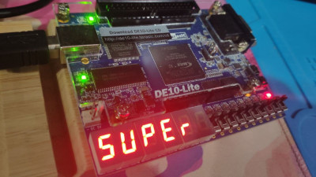
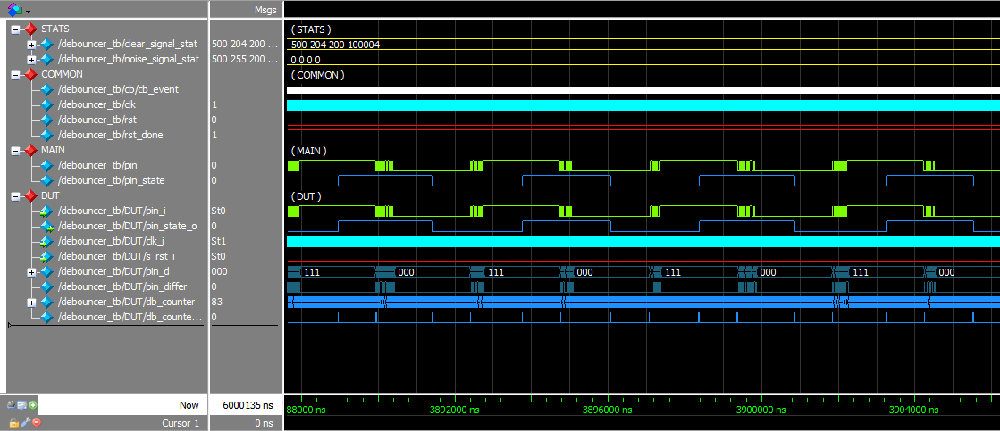
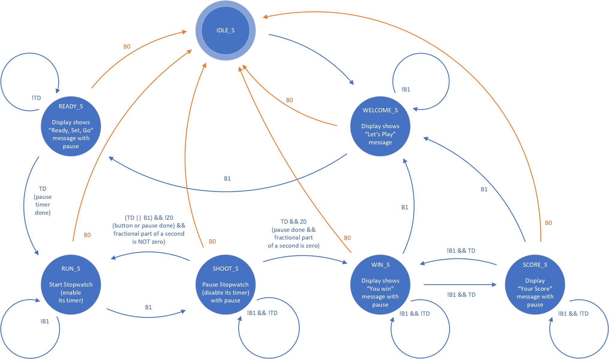
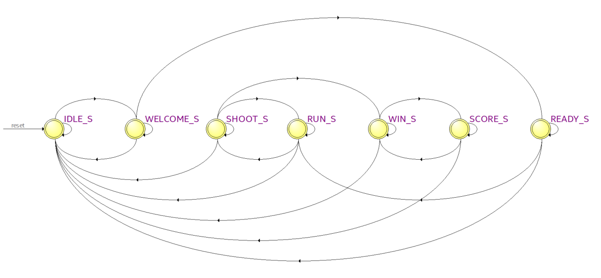
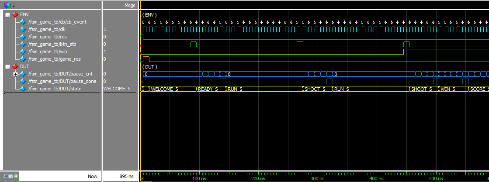
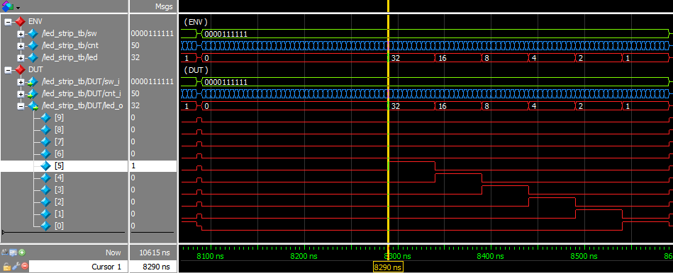
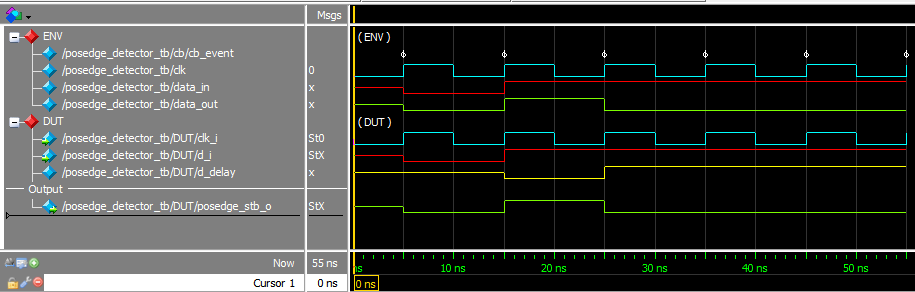
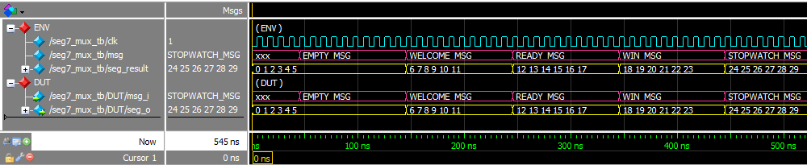
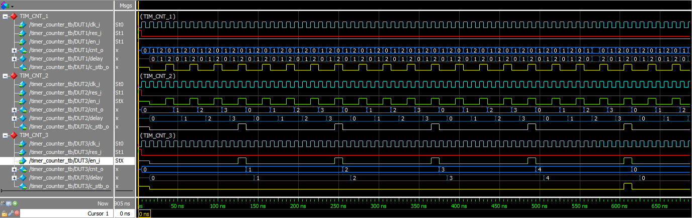

# FPGA ZeroStopwatch Game

This is my first finished SystemVerilog code of a simple game built for Terrasic DE10-Lite board.


## The Goal

You have to *'shoot'* at the moment of displaying two zeros on a fractional part of seconds indicators to win.



## Controls

* **KEY0** : RESET GAME (available at any moment)
* **KEY1** : GAME BUTTON (multifunctional, see 'Gameplay' section)
* **SW0**-**SW9** : Enables/disables a **LEDR** with the corresponding index to help you better understand when to 'shoot'
* **LEDR0**-**LEDR9** : LEDs can significantly help to hit the goal ;)

## Gameplay

* **POWER** it up and you will see the *'START'* message showing you that **game is ready**. This is the starting state of the game.
* Press **KEY0** any time you would like to reset the game and return to its initial state (see above).
* Press **KEY1** to start a new game  
You will see starting message *'GO-GO'* then game will be started and stopwatch start its running.  
* Press **KEY1** to *'shoot'* when you think that fractional part of second is equals to zero.  
After each *'shooting'* the stopwatch will stop for 1 second to show you the exact numbers you hit.
* Then there are two options:
  * **You WIN** hitting the '00'.
  then you will see congratulation message *'SUPER'* that will periodically changed with you time score.  
  Press **KEY1** to return to the beginning and start a new game!
  * **You missed the goal** hitting some digits but not '00'. You can wait for 1 second to return to game or click **KEY1** again to not wait and return to game immediately.

## Engineering Part

### Modules

All the modules excepting top game module stored in **'/rtl'** folder.

* **datatype_package.sv** contains enums shared across several modules  

* **debouncer.sv** module helps to synchronize the input button signal with the *clock signal* and ensures that *only a single signal* will be acted upon for a single opening or closing of contact (the code was mostly provided by [m1a1x1](https://github.com/m1a1x1) in his extreemly useful materials [here](https://github.com/stcmtk/fpga-webinar-2020)).  
  
  **Testbench**: /tb/debouncer_tb/debouncer_tb.sv  

  
  *(debouncer_tb timing diagram)*  
  
  <details><summary>ModelSim console output ...</summary>
  <p>

  ```
    # Starting tests. Config:
    #    PULSE_LENGTH (stable time for each input pulse) = 200
    #    TASKS_CNT (count of task to send)               = 1000
    #
    # Starting with sending 500 clear signals with no noise
    #     OK:
    #        Send pulses:            500
    #        Recieved pulses:        500
    #        Max pulse duration:     204
    #        Min pulse duration:     200
    #        Average pulse duration: 200.000000
    #
    # Starting test #2: sending 500 signals with noise
    #     OK:
    #      Send pulses:            500
    #      Recieved pulses:        500
    #      Max pulse duration:     255
    #      Min pulse duration:     200
    #      Average pulse duration: 224.000000
    #
    # ALL TESTS PASSED
  ```
  </p>
  </details>

* **fsm_game.sv** module implements the *Finit State Machine* for the game with the following states:
    
  *(finite state machine — human readable)*  
  
    
  *(finite state machine — generated)*  

  **Testbench**: /tb/fsm_game_tb/fsm_game_tb.sv  

    
  *(fsm_game_tb timing diagram)*  

  <details><summary>ModelSim console output ...</summary>
  <p>

  ```
    # TEST 1: DUT.state = IDLE_S, expected state = IDLE_S (time: 5)...
    #   OK (time: 5)
    #
    # TEST 2: DUT.state = WELCOME_S, expected state = WELCOME_S (time: 15)...
    #   OK (time: 15)
    #
    # TEST 3: DUT.state = WELCOME_S, expected state = WELCOME_S (time: 25)...
    #   OK (time: 25)
    #
    # TEST 3: DUT.state = WELCOME_S, expected state = WELCOME_S (time: 35)...
    #   OK (time: 35)
    #
    # TEST 3: DUT.state = WELCOME_S, expected state = WELCOME_S (time: 45)...
    #   OK (time: 45)
    #
    # TEST 3: DUT.state = WELCOME_S, expected state = WELCOME_S (time: 55)...
    #   OK (time: 55)
    #
    # TEST 3: DUT.state = WELCOME_S, expected state = WELCOME_S (time: 65)...
    #   OK (time: 65)
    #
    # TEST 3: DUT.state = WELCOME_S, expected state = WELCOME_S (time: 75)...
    #   OK (time: 75)
    #
    # TEST 3: DUT.state = WELCOME_S, expected state = WELCOME_S (time: 85)...
    #   OK (time: 85)
    # *
    # BUTTON STROBE signal (time: 85)
    #
    # TEST 3: DUT.state = READY_S, expected state = READY_S (time: 95)...
    #   OK (time: 95)
    #
    # TEST 4: DUT.state = READY_S, expected state = READY_S (time: 105)...
    #   OK (time: 105)
    #
    # TEST 4: DUT.state = READY_S, expected state = READY_S (time: 115)...
    #   OK (time: 115)
    #
    # TEST 4: DUT.state = READY_S, expected state = READY_S (time: 125)...
    #   OK (time: 125)
    #
    # TEST 4: DUT.state = READY_S, expected state = READY_S (time: 135)...
    #   OK (time: 135)
    #
    # TEST 4: DUT.state = RUN_S, expected state = RUN_S (time: 145)...
    #   OK (time: 145)
    #
    # TEST 5: DUT.state = RUN_S, expected state = RUN_S (time: 155)...
    #   OK (time: 155)
    #
    # TEST 5: DUT.state = RUN_S, expected state = RUN_S (time: 165)...
    #   OK (time: 165)
    #
    # TEST 5: DUT.state = RUN_S, expected state = RUN_S (time: 175)...
    #   OK (time: 175)
    #
    # TEST 5: DUT.state = RUN_S, expected state = RUN_S (time: 185)...
    #   OK (time: 185)
    #
    # TEST 5: DUT.state = RUN_S, expected state = RUN_S (time: 195)...
    #   OK (time: 195)
    #
    # TEST 5: DUT.state = RUN_S, expected state = RUN_S (time: 205)...
    #   OK (time: 205)
    #
    # TEST 5: DUT.state = RUN_S, expected state = RUN_S (time: 215)...
    #   OK (time: 215)
    #
    # TEST 5: DUT.state = RUN_S, expected state = RUN_S (time: 225)...
    #   OK (time: 225)
    #
    # TEST 5: DUT.state = RUN_S, expected state = RUN_S (time: 235)...
    #   OK (time: 235)
    #
    # TEST 5: DUT.state = RUN_S, expected state = RUN_S (time: 245)...
    #   OK (time: 245)
    #
    # TEST 5: DUT.state = RUN_S, expected state = RUN_S (time: 255)...
    #   OK (time: 255)
    #
    # TEST 5: DUT.state = RUN_S, expected state = RUN_S (time: 265)...
    #   OK (time: 265)
    # *
    # BUTTON STROBE signal (time: 265)
    #
    # TEST 5: DUT.state = SHOOT_S, expected state = SHOOT_S (time: 275)...
    #   OK (time: 275)
    #
    # TEST 5: DUT.state = SHOOT_S, expected state = SHOOT_S (time: 285)...
    #   OK (time: 285)
    #
    # TEST 5: DUT.state = SHOOT_S, expected state = SHOOT_S (time: 295)...
    #   OK (time: 295)
    #
    # TEST 5: DUT.state = SHOOT_S, expected state = SHOOT_S (time: 305)...
    #   OK (time: 305)
    #
    # TEST 5: DUT.state = SHOOT_S, expected state = SHOOT_S (time: 315)...
    #   OK (time: 315)
    #
    # TEST 5: DUT.state = RUN_S, expected state = RUN_S (time: 325)...
    #   OK (time: 325)
    #
    # TEST 6: DUT.state = RUN_S, expected state = RUN_S (time: 335)...
    #   OK (time: 335)
    #
    # TEST 6: DUT.state = RUN_S, expected state = RUN_S (time: 345)...
    #   OK (time: 345)
    #
    # TEST 6: DUT.state = RUN_S, expected state = RUN_S (time: 355)...
    #   OK (time: 355)
    #
    # TEST 6: DUT.state = RUN_S, expected state = RUN_S (time: 365)...
    #   OK (time: 365)
    #
    # TEST 6: DUT.state = RUN_S, expected state = RUN_S (time: 375)...
    #   OK (time: 375)
    #
    # TEST 6: DUT.state = RUN_S, expected state = RUN_S (time: 385)...
    #   OK (time: 385)
    #
    # TEST 6: DUT.state = RUN_S, expected state = RUN_S (time: 395)...
    #   OK (time: 395)
    #
    # TEST 6: DUT.state = RUN_S, expected state = RUN_S (time: 405)...
    #   OK (time: 405)
    #
    # TEST 6: DUT.state = RUN_S, expected state = RUN_S (time: 415)...
    #   OK (time: 415)
    #
    # TEST 6: DUT.state = RUN_S, expected state = RUN_S (time: 425)...
    #   OK (time: 425)
    #
    # TEST 6: DUT.state = RUN_S, expected state = RUN_S (time: 435)...
    #   OK (time: 435)
    #
    # TEST 6: DUT.state = RUN_S, expected state = RUN_S (time: 445)...
    #   OK (time: 445)
    # *
    # BUTTON STROBE signal (time: 445)
    #
    # TEST 6: DUT.state = SHOOT_S, expected state = SHOOT_S (time: 455)...
    #   OK (time: 455)
    #
    # TEST 6: DUT.state = SHOOT_S, expected state = SHOOT_S (time: 465)...
    #   OK (time: 465)
    #
    # TEST 6: DUT.state = SHOOT_S, expected state = SHOOT_S (time: 475)...
    #   OK (time: 475)
    #
    # TEST 6: DUT.state = SHOOT_S, expected state = SHOOT_S (time: 485)...
    #   OK (time: 485)
    #
    # TEST 6: DUT.state = SHOOT_S, expected state = SHOOT_S (time: 495)...
    #   OK (time: 495)
    #
    # TEST 6: DUT.state = WIN_S, expected state = WIN_S (time: 505)...
    #   OK (time: 505)
    #
    # TEST 7: DUT.state = WIN_S, expected state = WIN_S (time: 505)...
    #   OK (time: 505)
    #
    # TEST 7: DUT.state = WIN_S, expected state = WIN_S (time: 515)...
    #   OK (time: 515)
    #
    # TEST 7: DUT.state = WIN_S, expected state = WIN_S (time: 525)...
    #   OK (time: 525)
    #
    # TEST 7: DUT.state = WIN_S, expected state = WIN_S (time: 535)...
    #   OK (time: 535)
    #
    # TEST 7: DUT.state = WIN_S, expected state = WIN_S (time: 545)...
    #   OK (time: 545)
    #
    # TEST 7: DUT.state = SCORE_S, expected state = SCORE_S (time: 555)...
    #   OK (time: 555)
    #
    # TEST 7: DUT.state = SCORE_S, expected state = SCORE_S (time: 565)...
    #   OK (time: 565)
    #
    # TEST 7: DUT.state = SCORE_S, expected state = SCORE_S (time: 575)...
    #   OK (time: 575)
    #
    # TEST 7: DUT.state = SCORE_S, expected state = SCORE_S (time: 585)...
    #   OK (time: 585)
    #
    # TEST 7: DUT.state = SCORE_S, expected state = SCORE_S (time: 595)...
    #   OK (time: 595)
    #
    # TEST 7: DUT.state = WIN_S, expected state = WIN_S (time: 605)...
    #   OK (time: 605)
    #
    # TEST 7: DUT.state = WIN_S, expected state = WIN_S (time: 615)...
    #   OK (time: 615)
    #
    # TEST 7: DUT.state = WIN_S, expected state = WIN_S (time: 625)...
    #   OK (time: 625)
    #
    # TEST 7: DUT.state = WIN_S, expected state = WIN_S (time: 635)...
    #   OK (time: 635)
    #
    # TEST 7: DUT.state = WIN_S, expected state = WIN_S (time: 645)...
    #   OK (time: 645)
    #
    # TEST 7: DUT.state = SCORE_S, expected state = SCORE_S (time: 655)...
    #   OK (time: 655)
    #
    # TEST 7: DUT.state = SCORE_S, expected state = SCORE_S (time: 665)...
    #   OK (time: 665)
    #
    # TEST 7: DUT.state = SCORE_S, expected state = SCORE_S (time: 675)...
    #   OK (time: 675)
    #
    # TEST 7: DUT.state = SCORE_S, expected state = SCORE_S (time: 685)...
    #   OK (time: 685)
    #
    # TEST 7: DUT.state = SCORE_S, expected state = SCORE_S (time: 695)...
    #   OK (time: 695)
    #
    # TEST 7: DUT.state = WIN_S, expected state = WIN_S (time: 705)...
    #   OK (time: 705)
    #
    # TEST 7: DUT.state = WIN_S, expected state = WIN_S (time: 715)...
    #   OK (time: 715)
    #
    # TEST 7: DUT.state = WIN_S, expected state = WIN_S (time: 725)...
    #   OK (time: 725)
    #
    # TEST 7: DUT.state = WIN_S, expected state = WIN_S (time: 735)...
    #   OK (time: 735)
    #
    # TEST 7: DUT.state = WIN_S, expected state = WIN_S (time: 745)...
    #   OK (time: 745)
    #
    # TEST 7: DUT.state = SCORE_S, expected state = SCORE_S (time: 755)...
    #   OK (time: 755)
    #
    # TEST 7: DUT.state = SCORE_S, expected state = SCORE_S (time: 765)...
    #   OK (time: 765)
    #
    # TEST 7: DUT.state = SCORE_S, expected state = SCORE_S (time: 775)...
    #   OK (time: 775)
    #
    # TEST 7: DUT.state = SCORE_S, expected state = SCORE_S (time: 785)...
    #   OK (time: 785)
    #
    # TEST 7: DUT.state = SCORE_S, expected state = SCORE_S (time: 795)...
    #   OK (time: 795)
    # *
    # BUTTON STROBE signal (time: 815)
    #
    # TEST 7: DUT.state = IDLE_S, expected state = IDLE_S (time: 825)...
    #   OK (time: 825)
    #
    # ALL TESTS PASSED
    ```
  </p>
  </details>  
  
* **led_strip.sv** module implements the combinational logic between switches SW, stopwatch fractional part, and LEDs.  
  
  **Testbench**: /tb/led_strip_tb/led_strip_tb.sv  
  
    
  *(led_strip_tb timing diagram)*  
  
  <details><summary>ModelSim console output ...</summary>
  <p>

  ```
    # RULES:
    # 	LED #9 ON for CNT [10..19]
    # 	LED #8 ON for CNT [20..29]
    # 	LED #7 ON for CNT [30..39]
    # 	LED #6 ON for CNT [40..49]
    # 	LED #5 ON for CNT [50..59]
    # 	LED #4 ON for CNT [60..69]
    # 	LED #3 ON for CNT [70..79]
    # 	LED #2 ON for CNT [80..89]
    # 	LED #1 ON for CNT [90..99]
    # 	LED #0 ON for CNT [ 0.. 9]
    #
    # TEST: LED ON for all CNT with SW = 1111111111 (time: 10)...
    #   OK (time: 510)
    #
    # TEST: LED ON for all CNT with SW = 1 (time: 515)...
    #   OK (time: 1015)
    #
    # TEST: LED ON for all CNT with SW = 10 (time: 1020)...
    #   OK (time: 1520)
    #
    # TEST: LED ON for all CNT with SW = 100 (time: 1525)...
    #   OK (time: 2025)
    #
    # TEST: LED ON for all CNT with SW = 1000 (time: 2030)...
    #   OK (time: 2530)
    #
    # TEST: LED ON for all CNT with SW = 10000 (time: 2535)...
    #   OK (time: 3035)
    #
    # TEST: LED ON for all CNT with SW = 100000 (time: 3040)...
    #   OK (time: 3540)
    #
    # TEST: LED ON for all CNT with SW = 1000000 (time: 3545)...
    #   OK (time: 4045)
    #
    # TEST: LED ON for all CNT with SW = 10000000 (time: 4050)...
    #   OK (time: 4550)
    #
    # TEST: LED ON for all CNT with SW = 100000000 (time: 4555)...
    #   OK (time: 5055)
    #
    # TEST: LED ON for all CNT with SW = 1000000000 (time: 5060)...
    #   OK (time: 5560)
    #
    # TEST: LED ON for all CNT with SW = 1 (time: 5565)...
    #   OK (time: 6065)
    #
    # TEST: LED ON for all CNT with SW = 11 (time: 6070)...
    #   OK (time: 6570)
    #
    # TEST: LED ON for all CNT with SW = 111 (time: 6575)...
    #   OK (time: 7075)
    #
    # TEST: LED ON for all CNT with SW = 1111 (time: 7080)...
    #   OK (time: 7580)
    #
    # TEST: LED ON for all CNT with SW = 11111 (time: 7585)...
    #   OK (time: 8085)
    #
    # TEST: LED ON for all CNT with SW = 111111 (time: 8090)...
    #   OK (time: 8590)
    #
    # TEST: LED ON for all CNT with SW = 1111111 (time: 8595)...
    #   OK (time: 9095)
    #
    # TEST: LED ON for all CNT with SW = 11111111 (time: 9100)...
    #   OK (time: 9600)
    #
    # TEST: LED ON for all CNT with SW = 111111111 (time: 9605)...
    #   OK (time: 10105)
    #
    # TEST: LED ON for all CNT with SW = 1111111111 (time: 10110)...
    #   OK (time: 10610)
    #
    # ALL TESTS PASSED
    ```
  </p>
  </details>  
  
* **posedge_detector.sv** module generates the single strobe on positive edge of a signal (the code was kidly provided by [m1a1x1](https://github.com/m1a1x1) in his extreemly useful materials [here](https://github.com/stcmtk/fpga-webinar-2020)).  

  **Testbench**: /tb/posedge_detector_tb/posedge_detector_tb.sv  

  
  *(posedge_detector_tb timing diagram)*  
  
  <details><summary>ModelSim console output ...</summary>
  <p>

    ```
    # TEST #1: Both signals DUT.d_i and DUT.posedge_stb_o rising together...
    #   OK
    #
    # TEST #2: DUT.posedge_stb_o goes low even if DUT.d_i continue has high value...
    #   OK
    ```
  </p>
  </details>  
  
* **seg7.sv** module imlements combinational logic between decimal digit and single 7-segment indocator with some sugar:
  * can don't display anything at all if input decimal digit is "0",
  * controls decimal and fractional separation point.  
  
  Testbench: *TBD*.

* **seg7_mux.sv** module for selecting from several options what to display on the display depending on the *msg_t* - message type.    

  **Testbench**: /tb/seg7_mux_tb/seg7_mux_tb.sv  


    
  *(seg7_mux timing diagram)*  
  
  <details><summary>ModelSim console output ...</summary>
  <p>

    ```
    # TEST: EMPTY_MSG (time: 46)...
    #   OK:
    # 	Expected: DUT.msg_i =     EMPTY_MSG, DUT.seg_o = {  0,  1,  2,  3,  4,  5 }
    # 	Actual  : DUT.msg_i =     EMPTY_MSG, DUT.seg_o = {  0,  1,  2,  3,  4,  5 }
    #
    # TEST: WELCOME_MSG (time: 146)...
    #   OK:
    # 	Expected: DUT.msg_i =   WELCOME_MSG, DUT.seg_o = {  6,  7,  8,  9, 10, 11 }
    # 	Actual  : DUT.msg_i =   WELCOME_MSG, DUT.seg_o = {  6,  7,  8,  9, 10, 11 }
    #
    # TEST: READY_MSG (time: 246)...
    #   OK:
    # 	Expected: DUT.msg_i =     READY_MSG, DUT.seg_o = { 12, 13, 14, 15, 16, 17 }
    # 	Actual  : DUT.msg_i =     READY_MSG, DUT.seg_o = { 12, 13, 14, 15, 16, 17 }
    #
    # TEST: WIN_MSG (time: 346)...
    #   OK:
    # 	Expected: DUT.msg_i =       WIN_MSG, DUT.seg_o = { 18, 19, 20, 21, 22, 23 }
    # 	Actual  : DUT.msg_i =       WIN_MSG, DUT.seg_o = { 18, 19, 20, 21, 22, 23 }
    #
    # TEST: STOPWATCH_MSG (time: 446)...
    #   OK:
    # 	Expected: DUT.msg_i = STOPWATCH_MSG, DUT.seg_o = { 24, 25, 26, 27, 28, 29 }
    # 	Actual  : DUT.msg_i = STOPWATCH_MSG, DUT.seg_o = { 24, 25, 26, 27, 28, 29 }
    #
    # ALL TESTS PASSED
    ```
  </p>
  </details>  
  

* **seg7_stopwatch.sv** module connects six pairs of digit segments and their counters (seg7 - timer_counter) for providing the required time format output for the stopwatch:  
  ```
  mm.ss.ff
  ```
  The first counter 'clk_counter' doesn't have its seg7 paid. It gets the input clock 50 MHz and generates the single strobe each 10 ms. This strobe is used as enable signal 'en_i' for the next counter - 'tim_10ms_counter'. This 'tim_10ms_counter' is connected with the fastest digital segment and has its internal counter having values 0..9. Each 100 ms 'tim_10ms_counter' resets to 0 value and generates single output strobe for being used in 'tim_100ms_counter' as enable signal 'en_i'. And so on up to 10-minutes-pair of counter-indicator.  
  
  I didn't write its own testbench for that component as it mostly consists of linking internal pairs of 'timer_counter' and 'seg7' module instances. I tried to compensate it in the 'timer_counter_tb' where I connected 3 instances of such counters and checked on the timing diagram that this linking works accurate enough (see the next module).  
  
  Testbench: *TBD*.

* **timer_counter.sv** module describes the simple counter with *synchrious reset* 'res_i' and *enable* 'en_i' signals. Excepting the usual output vector 'cnt_o' it has output 'c_stb_o' signal having high value each time when counter one cycle before its overflow and reset.  
  
  **Testbench**: /tb/timer_counter_tb/timer_counter_tb.sv  

  
  *(timer_counter_tb timing diagram)*  

  Unfortunately, I didn't write the automatic checks in this testbench yet. But the graphical presentation looks awesome :)

## Thanks time :)

I would like to say **thank you** to [m1a1x1](https://github.com/m1a1x1) who's [FPGA course](https://www.youtube.com/playlist?list=PLOiK7Vmp7kf-YmjuuJKvDvmJdxKs826kx) helped me in my very beginning path to FPGA development.
